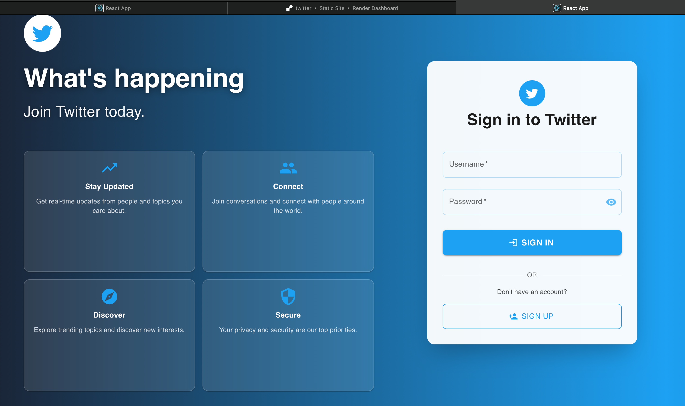
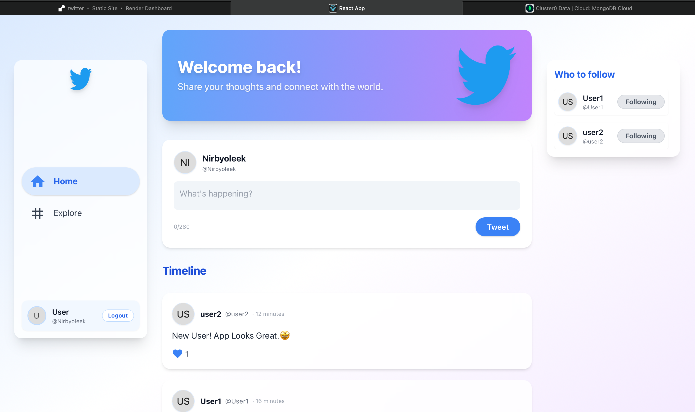

# 🐦 Twitter-Clone

A modern, full-stack Twitter clone built with React, Redux, Node.js, Express, and MongoDB. Experience real-time tweeting, authentication, profile management, and a beautiful, responsive UI inspired by Twitter.

---

## 🚀 Features

- 📝 **Sign Up & Sign In** (Gmail only, with validation)
- 🔒 **JWT Authentication**
- 🐦 **Tweet, Like, and Explore**
- 🏠 **Personalized Home Feed**
- 🔍 **Trending Topics & Explore Page**
- 👤 **User Profiles & Follow System**
- 🌙 **Dark Mode** (manual or system-based)
- ⚡ **Skeleton Loaders & Animations**
- 📱 **Responsive Design**
- ☁️ **Deployed on Render**

---

## 🛠️ Tech Stack

- **Frontend:** React, Redux, Tailwind CSS, Framer Motion, Material-UI
- **Backend:** Node.js, Express, MongoDB, JWT
- **Other:** Axios, react-hot-toast, react-loading-skeleton

---

## 🖥️ Screenshots

### Login Page


### Home Page


---

## 🏗️ Local Setup

1. **Clone the repo:**
   ```bash
   git clone https://github.com/Nirbyoleek/Twitter-Clone.git
   cd Twitter-Clone
   ```
2. **Install dependencies:**
   ```bash
   npm install
   cd server && npm install && cd ..
   ```
3. **Set up environment variables:**
   - Create a `.env` file in `/server` with your MongoDB URI and JWT secret:
     ```env
     MONGO_URL=your_mongodb_connection_string
     JWT_SECRET=your_jwt_secret
     ```
4. **Run the backend:**
   ```bash
   cd server
   npm start
   ```
5. **Run the frontend:**
   ```bash
   npm start
   ```

---

## 🌍 Deployment (Render)

- The app is ready for deployment on [Render](https://render.com/).
- **Node.js 18+ is required** (see `package.json` engines field).
- Push your code to GitHub and connect your repo on Render.
- Set environment variables in the Render dashboard for the backend.

---

## ⚙️ Environment Variables

- `MONGO_URL` — MongoDB connection string
- `JWT_SECRET` — JWT secret key

---

## 🙏 Credits

- Inspired by [Twitter](https://twitter.com)
- UI: [Tailwind CSS](https://tailwindcss.com/), [Material-UI](https://mui.com/), [Framer Motion](https://www.framer.com/motion/)
- Backend: [Express](https://expressjs.com/), [MongoDB](https://www.mongodb.com/)

---

## 📄 License

This project is for educational purposes. Feel free to fork and build upon it!
